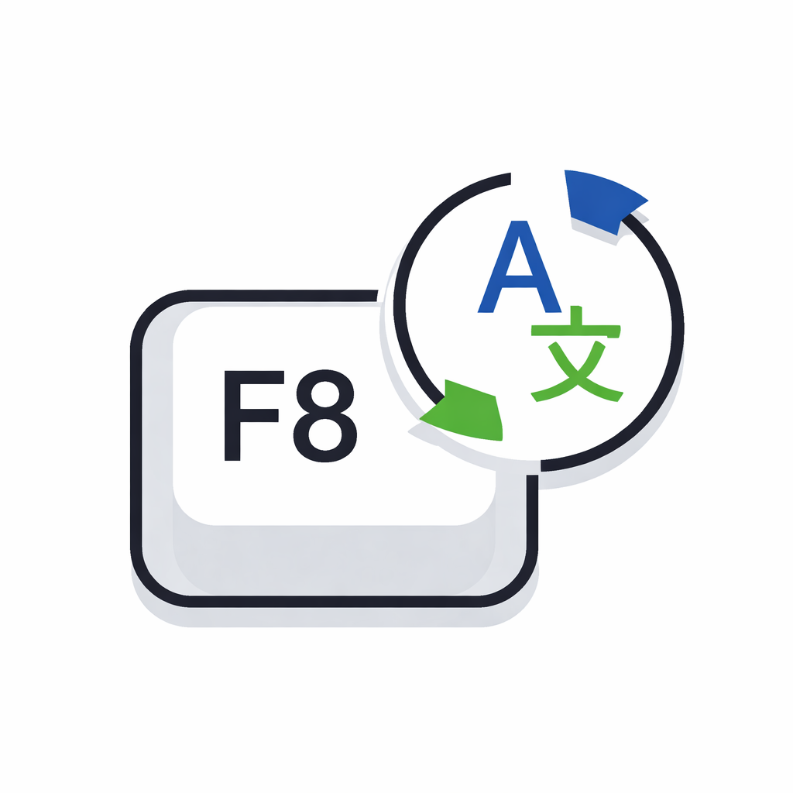

<p align="center">
  
</p>


# f8translate
A simple Python tool that translates selected text instantly using a global hotkey (F8).

F8 Translate é uma ferramenta simples de tradução instantânea por atalho de teclado.
Ela permite traduzir rapidamente um texto selecionado em qualquer aplicativo,
utilizando apenas a tecla **F8**.

O projeto é mantido como hobby e tem foco em produtividade, praticidade
e aprendizado.

---

## 🚀 Como usar

1. Selecione o texto que deseja traduzir  
   (recomenda-se usar `Ctrl + A` para selecionar todo o texto)
2. Pressione a tecla **F8**
3. O texto será automaticamente traduzido e colado no lugar

Funciona em qualquer aplicativo onde seja possível selecionar texto
(Discord, navegador, editores de texto, etc.).

---

## ▶️ Como rodar o projeto

### Pré-requisitos
- Ter o **Python 3** instalado no computador
- Ter as dependências instaladas

### Instalando dependências

```bash
pip install -r requirements.txt
```

### Executando

Atualmente, o projeto é executado através de um arquivo `.bat`.

1. Abra o arquivo `iniciar.bat`
2. Mantenha o terminal aberto enquanto estiver usando o F8 Translate

---

## ⚠️ Limitações conhecidas

- O F8 Translate traduz apenas textos que você escreve ou seleciona.
  Ainda não é possível traduzir textos exibidos em aplicativos apenas pressionando
  a tecla sem seleção prévia.

- O objetivo principal é auxiliar quando você já entende razoavelmente o texto
  original ou deseja escrever rapidamente em outro idioma.

- No momento, não é possível alterar o atalho por interface.
  Para mudar o atalho, é necessário editar manualmente a linha abaixo no código:

```python
ATALHO = 'f8'
```

- Futuramente, quando o projeto tiver uma interface, essa configuração será adicionada.

---

## 🛠️ Status do projeto

Projeto em desenvolvimento, mantido como hobby e focado em aprendizado e experimentação.

---

## 📄 Licença

Este projeto utiliza a licença MIT.
